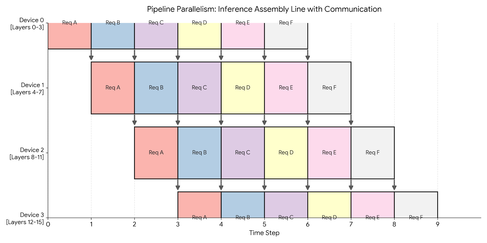

# Pipelining

Pipelining is a model parallelism strategy used when a model is too large to fit into the memory of a single device. Instead of sharding the data, we partition the model itself.

We vertically slice the model and assign a group of layers to each device. For example, if we have 4 devices and 16 layers: Device 0 holds layers 0-3, Device 1 holds layers 4-7, and so on.



## Inference

During inference, Pipeline Parallelism acts like a factory assembly line.

We can achieve 100% utilization by keeping the pipeline full. As soon as Device 0 finishes processing Request A and passes it to Device 1, it immediately picks up Request B. We fully overlap communication with computation.

### Code for inference only using the [Fake API](./strategies.md)

We run the same model as in [Fake API](./strategies.md) but with an arbitrary amount of layers. This time, we have one layer per device. Device 0 will run layer 0. Device 1 will run ReLU and layer 1, etc. So even indices will run their layers only and odd indices will run ReLU and their layer. We implement the `inference_loop` to handle communicating the outputs of each layer.

```python
class PipeliningInferenceOnly(ShardedEngine):
    def __init__(self, model_dim: int, hidden_dim: int):
        if self.device_id % 2 == 0:
            self.weights = np.zeros((model_dim, hidden_dim), dtype=np.float32)
        else:
            self.weights = np.zeros((hidden_dim, model_dim), dtype=np.float32)

    def load_checkpoint(self, params: dict[str, npt.ArrayLike]) -> None:
        # Load weights into local memory
        self.weights[...] = params[f'layers_{self.device_id}/weights'][...]

    def forward(self, x: npt.ArrayLike) -> npt.ArrayLike:
        # On odd layers (which receive hidden_dim), apply ReLU first
        if self.device_id % 2 != 0:
            x = relu(x)
        return np.einsum('bd,df->bf', x, self.weights)

    def inference_loop(self, input_stream: Reader[npt.ArrayLike], output_stream: Writer[npt.ArrayLike]) -> None:
        # LOGIC FOR DEVICE 0 (The Source)
        if self.device_id == 0:
            for x in iter(input_stream):
                out = self.forward(x)
                self.send(1, out)
        # LOGIC FOR OTHER DEVICES
        else:
            while True:
                # Block until we get data from the previous device
                x = self.receive(self.device_id - 1)
                out = self.forward(x)
                # If I am the last device, write to disk/network
                if self.device_id == self.num_devices - 1:
                    output_stream.write(out)
                else:
                    self.send(self.device_id + 1, out)
```

## Training

Training is significantly harder due to the bidirectional dependency between the forward and backward pass.

- **Forward Dependency:** Layer `N` needs input from Layer `N-1`.
- **Backward Dependency:** Layer `N-1` needs gradients from Layer `N`.

This creates a wait time known as the **Pipeline Bubble.**

- **Idle Start:** Device 3 sits idle waiting for the first data to propagate through Devices 0, 1, and 2.
- **Idle End:** Device 0 sits idle after its backward pass, waiting for the gradients to propagate back from Device 3.

**Solution: Micro-batching** To minimize the bubble, we split the global batch into smaller micro-batches. By processing smaller chunks, we can pass data to the next device sooner, allowing the pipeline to fill up faster.

## Pros and cons

Pipelining is optimized for **throughput** (requests per second) at the cost of **latency** (time per request). It effectively uses multiple chips to simulate a single, massive chip.

| Feature | Impact | Why? |
| :--- | :--- | :--- |
| **Throughput** | ✅ **High** | During inference (or well-tuned training), all devices work in parallel. |
| **Communication** | ✅ **Low** | We only send activations between devices at the boundaries (e.g., after layer 4). This is much cheaper than Tensor Parallelism. |
| **Latency** | ❌ **High** | A single request must travel **sequentially** through all devices. Device 4 cannot start until Device 3 finishes. |
| **Memory** | ✅ **Efficient** | Parameters are **split across devices**, allowing us to fit larger models. |
