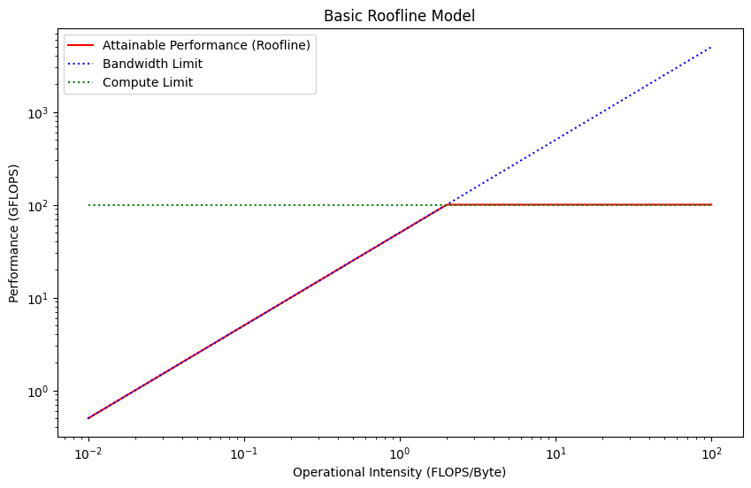

# Roofline Model

The roofline model measures the peak throughput of the chip.

## The Core Concept: Arithmetic Intensity

**Arithmetic Intensity (AI):** is a characteristic of your algorithm. It's the ratio of compute to memory access.

```python
AI = flops / data_moved
```

The achievable performance will be expressed as

```python
perf = min(peak_flops, peak_bandwidth * AI)
```



## Takeaway

The key takeaway is that as long as we are memory bound, increasing the arithmetic intensity will yield significant throughput improvements. When we are compute bound, increasing the arithmetic intensity, will commensurably increase the latency, resulting in no throughput gains. Therefore, we always want to be compute bound for throughput, but any point on the "flat part" of the roofline will be as efficient as any other.
