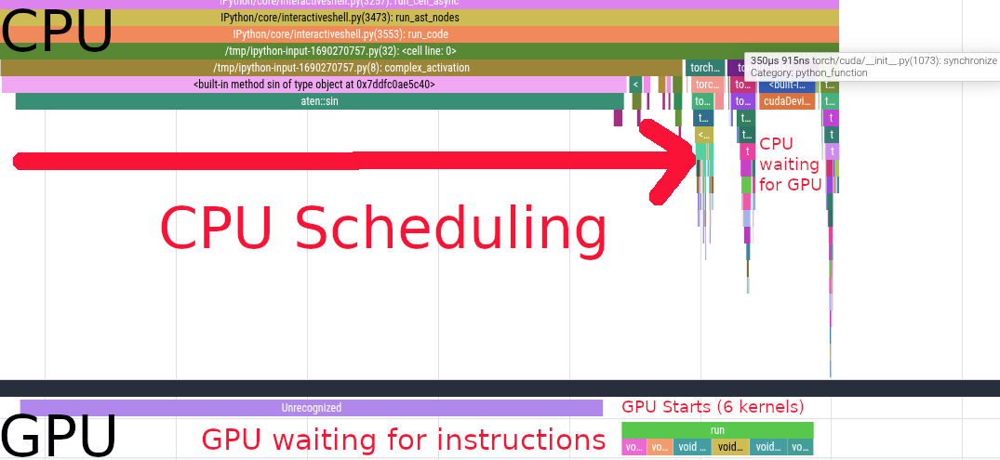

# Eager Mode

We need to first understand `Eager Mode` to understand how compilation improves perfomance on top of it.

`Eager Mode` is the standard execution model of `Jax` and `PyTorch`. When you run ML code without `torch.compile` or `jax.jit`, you are executing code on the CPU in the `Python runtime`, this code sends instructions to the `GPU` or `TPU` that actually performs the computations.

When you chain multiple operations one after the other, the `CPU` doesn't wait for the `GPU/TPU` to complete its task, it takes the next operation and already schedule it concurrently to the `GPU/TPU`'s execution. When all operations have been scheduled, the `CPU` waits for the `GPU/TPU`'s work to be over.

Let's have a look at this `PyTorch` function running on GPU.

```python
import torch
from torch.profiler import profile, record_function, ProfilerActivity

def complex_activation(x, y):
    # Eager PyTorch launches 6 separate kernels for this:
    # Read/Write memory 6 times!
    a = torch.sin(x)
    b = torch.cos(y)
    c = a * b
    d = c + x
    e = d * y
    return torch.relu(e)
```

**The Bottleneck:** In Eager Mode, every line of code above requires reading data from the GPU's memory (HBM), computing, and writing the result back. We are constantly moving data back and forth, which is often slower than the math itself.

We profile it using the torch profiler

```python
N = 20 * 1024 * 1024 
x = torch.randn(N, device='cuda')
y = torch.randn(N, device='cuda')

torch.cuda.synchronize()
# Warmup
complex_activation(x, y)
torch.cuda.synchronize()

with profile(
    activities=[ProfilerActivity.CPU, ProfilerActivity.CUDA],
    record_shapes=True,
    with_stack=True
) as prof:
    with record_function(f"run"):
      complex_activation(x, y)
    torch.cuda.synchronize()
```



We see the CPU scheduling the first `sin` call. Scheduling the first kernel is very slow because of the synchronization overhead. After that, we see a bunch of other kernels being scheduled on the `CPU` side, those are `cos`, `a * b`, `c + x`, `d * y` and `relu`.

We see that the `GPU` starts working while the `CPU` is still scheduling instructions. After scheduling, the `CPU` starts waiting for the `GPU` to complete its work. The `GPU` executes 6 different kernels in \\(731\mu s\\).
