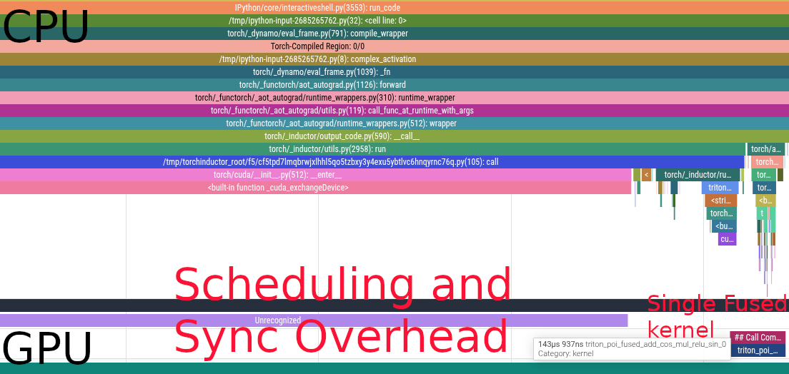
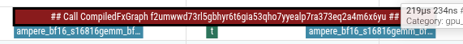

# Optimizations

When running code in [Eager Mode](./eager_mode.md), `PyTorch` and `Jax` see function calls one at a time. They cannot reason holistically about how these functions interact together. So while each individual function is written optimally, the transitions between functions are suboptimal.

On the contrary, `jax.jit` and `torch.compile` allow their compilers to see the whole code ahead of time. This gives them the opportunity to fuse, rewrite, and eliminate code optimally.

## Kernel Fusions

Let's take another look at the [code from the previous chapter](./eager_mode.md).

```python
def complex_activation(x, y):
    # Eager PyTorch launches 6 separate kernels for this:
    # Read/Write memory 6 times!
    a = torch.sin(x)
    b = torch.cos(y)
    c = a * b
    d = c + x
    e = d * y
    return torch.relu(e)

opt_activation = torch.compile(complex_activation)
```

In [Eager Mode](./eager_mode.md), we scheduled 6 different kernels one after the other. This means that the `GPU` had to load from `HBM` the whole array each time and then write it back in between kernels.

When we compile the code, `PyTorch` fuses all the kernels, allowing the `GPU` to load the arrays `x` and `y` from `HBM` once, and applying all the computations once from fast memory.

Here's the flame graph



We now have a single kernel instead of 6. Bringing the latency down from \\(731\mu s\\) to \\(144\mu s\\).

## Buffer Reuse

When an array is read once and not needed after, ML compilers can reuse the memory space instead of constantly reallocating. This saves both memory and latency by increasing cache locality.

In the previous example, compilers need to allocate for `x` and `y`. Then

- We have to allocate `a` and `b` because `x` and `y` are needed later
- `a` (or `b`) can be overwritten with `c` because they are not reused
- `x` can be overwritten with `d`
- `y` can be overwritten `e` which can be muttated in place before returning

## Relayout

ML compilers are able to reason about the best layout for your operations. For instance, the `MXU` on the `TPU` operates on array of shape \\((8, 128)\\) at least. If you have an einsum with an input shape \\((64, 4, 1024)\\), the `4` being a non contracted batch dimension like the number of heads in attention, `jax.jit` will transpose your array to \\((4, 64, 1024)\\) under the hood, making full use of the `MXU`.

## Dead Code Elimination

Sometimes, we write code that is not needed for anything. It is not returned, nor does it have any effects (like print). This code is completely safe to be removed from the program.

For instance, in this example the `x @ gating1` call is absent from the flame graph

```python
def mlp(x, gating0, gating1, linear):
    y = x @ gating0
    # x @ gating1 is never accessed, this computation is useless
    # it is eliminated by the compiler
    unused = x @ gating1

    y = torch.nn.functional.relu(y)
    out = y @ linear
    return out

compiled_mlp = torch.compile(mlp)

device = torch.device("cuda")


generator = torch.Generator(device=device).manual_seed(0)

b = 512
d = 2048
f = 2 * d

x = torch.randn((b, d), generator=generator, device=device, dtype=torch.bfloat16)
gating0 = torch.randn((d, f), generator=generator, device=device, dtype=torch.bfloat16)
gating1 = torch.randn((d, f), generator=generator, device=device, dtype=torch.bfloat16)
linear = torch.randn((f, d), generator=generator, device=device, dtype=torch.bfloat16)
```



**There are only 2 `gemm` kernel calls**
